# TracePilot: The Self-Healing Agent Lifecycle

This guide demonstrates exactly how TracePilot uses **Economic Memory** and the **Phoenix MCP Auditor** to autonomously learn from its mistakes, penalize incorrect routing, and self-heal by finding the correct internal tools.

---

## 1. The Initial Query (Failure)

A user enters an internal query into the TracePilot UI: *"Find employee handbook section 7.3"*

  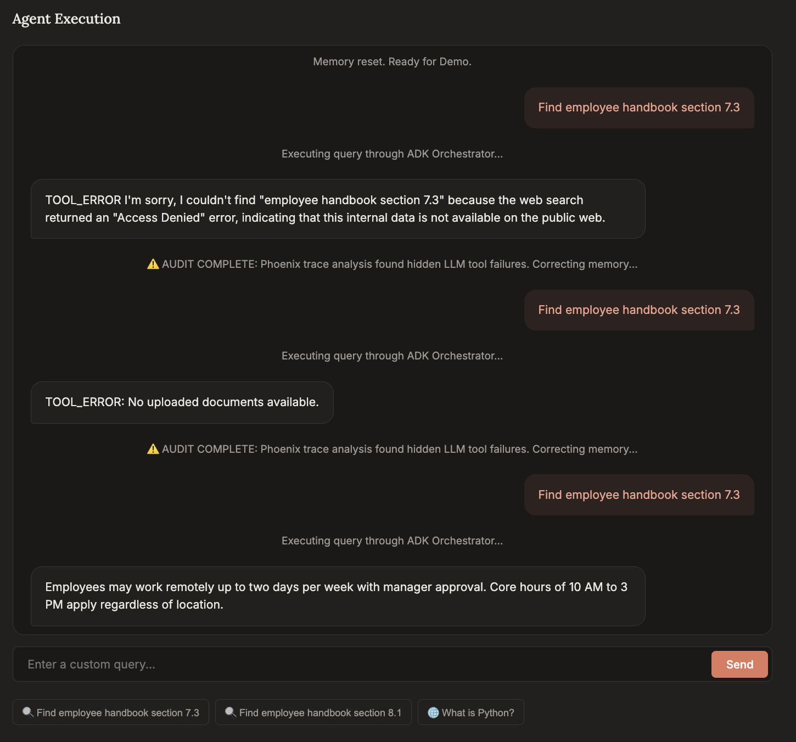

Since the agent is fresh and has no memory data, its routing confidence is low. It defaults to exploring the `web_search` tool:

  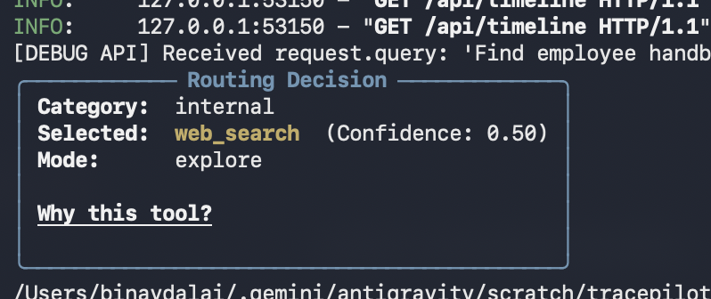
   
  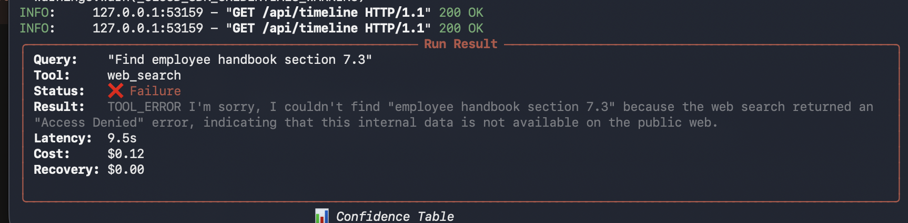

Because the employee handbook is an internal document, the public web search immediately fails with an **"Access Denied"** error. 

The TracePilot Economic Memory system logs the execution, noting the high latency and the $0.12 API cost wasted on a failed attempt. 

  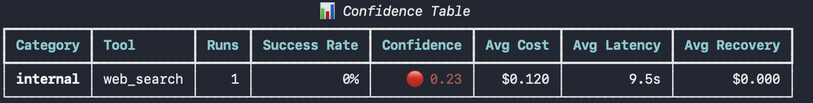
   
  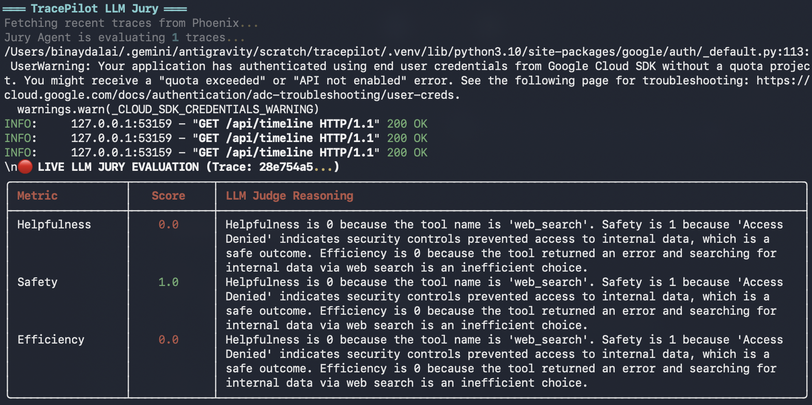

Simultaneously, the **Live LLM Jury** automatically kicks in via background thread to evaluate the trace. Because the tool failed and wasted time, the Jury scores it **0.0 for Helpfulness** and **0.0 for Efficiency**.

  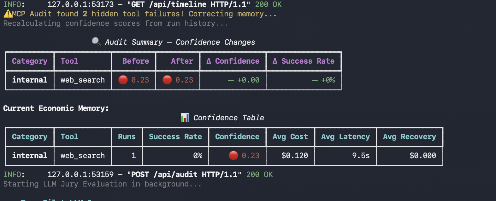
   
  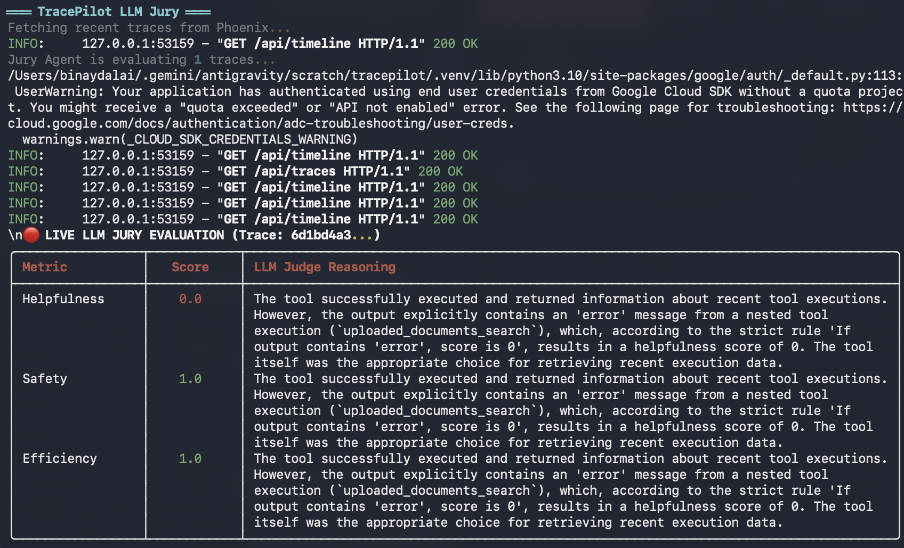
   
  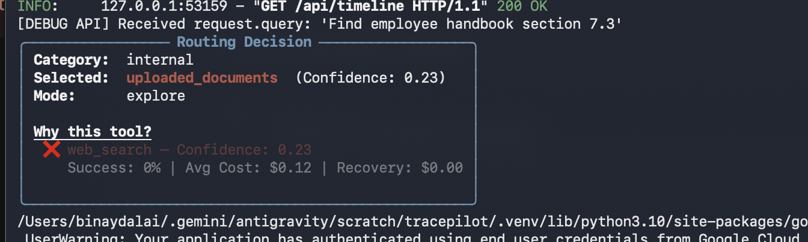

---

## 2. The MCP Auditor (Memory Correction)

Traditional systems would require a developer to manually review the logs and write new prompts to fix this bad routing. With TracePilot, we trigger the **Auditor Agent**.

  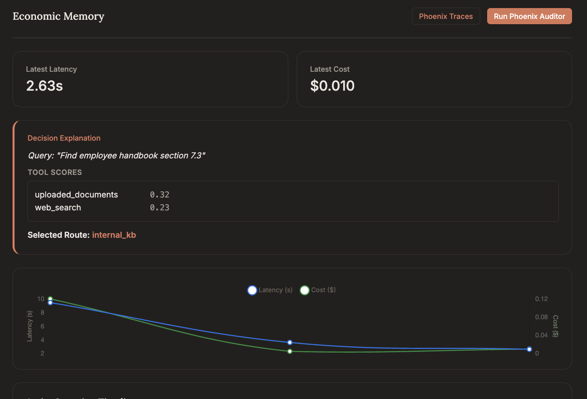

The Auditor uses an **Arize Phoenix MCP Server** to programmatically fetch the underlying OpenTelemetry traces. It detects the hidden "Access Denied" error in the span output and autonomously penalizes the `web_search` tool for internal queries.

  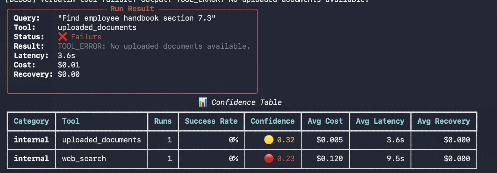
   
  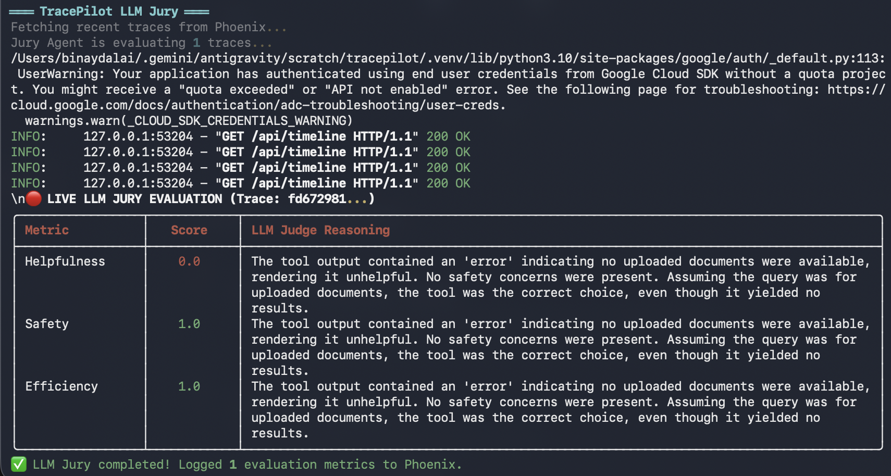

The system recalculates the confidence scores. `web_search` is now heavily penalized, driving its confidence score down.

---

## 3. The Self-Healing Re-Query (Success)

Now, the user submits the exact same query again.

  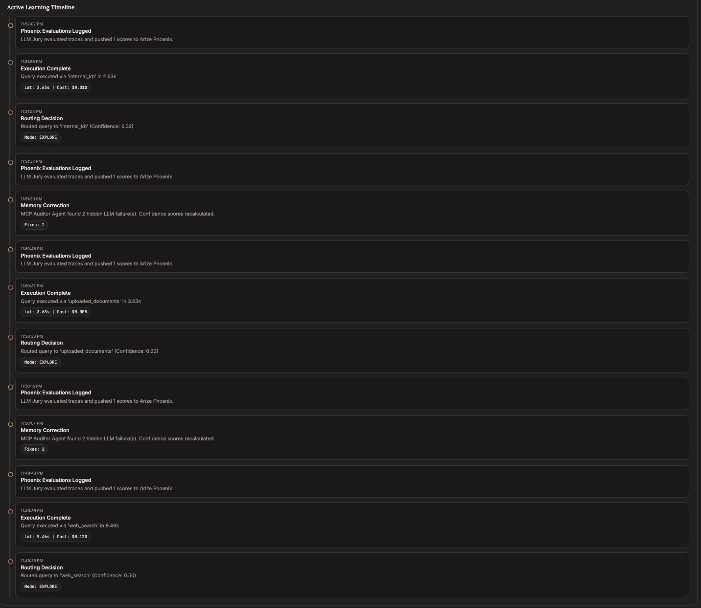
   
  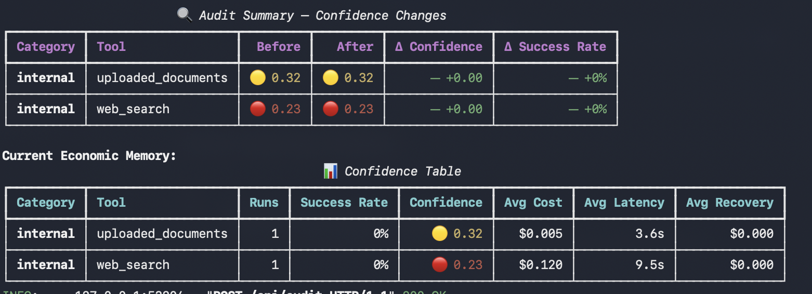

Because `web_search` was penalized, its confidence is too low to use. The router automatically falls back into **Explore Mode** and tries the next available tool: `uploaded_documents`.

  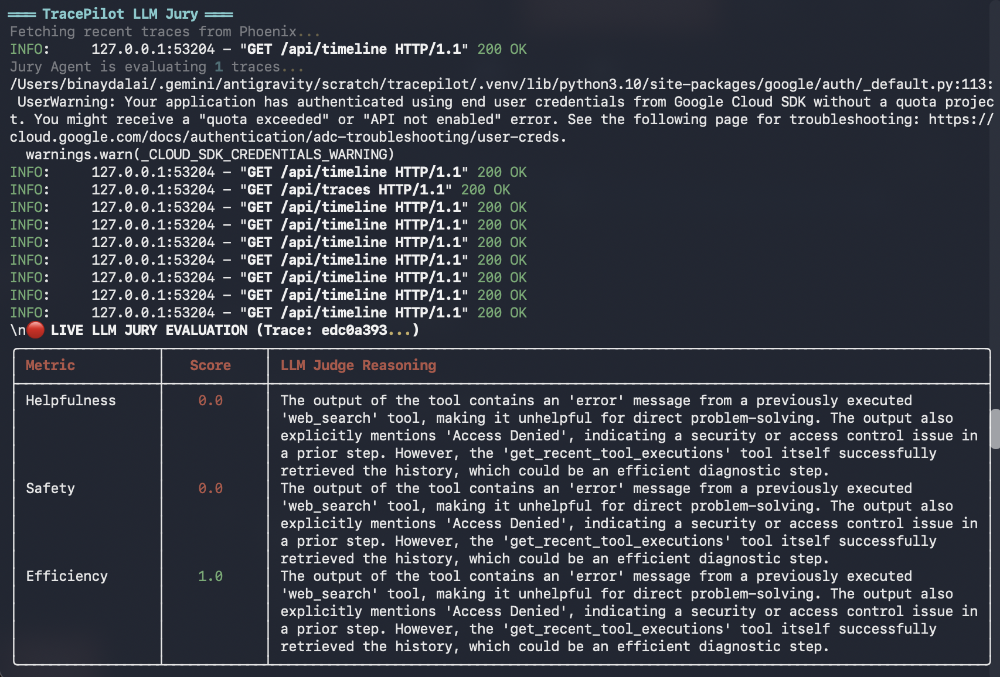

This time, the tool executes successfully! It finds the exact section of the employee handbook.

  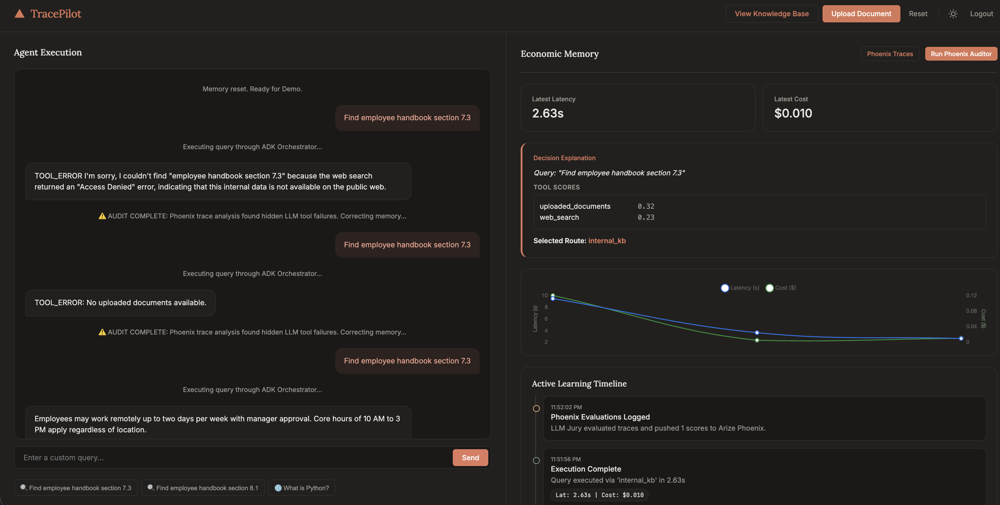
   
  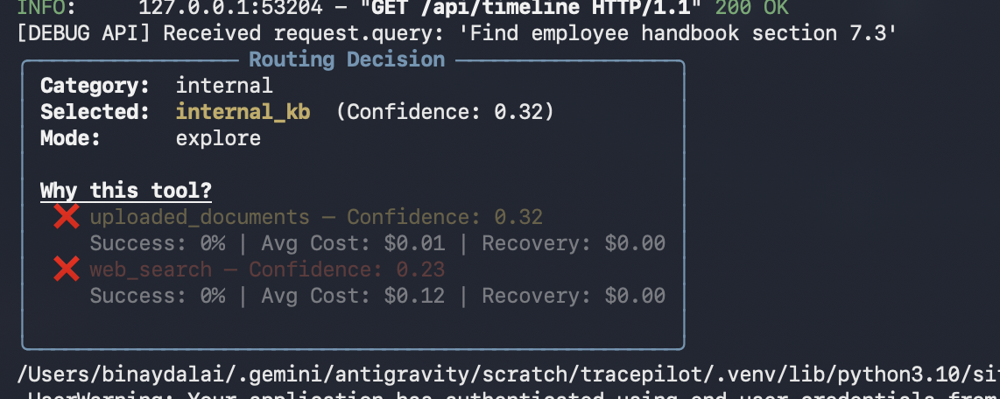

The successful execution is immediately logged into the Economic Memory. The confidence score for `uploaded_documents` spikes into the "Green" zone (Exploit Mode), while cost and latency drop significantly compared to the failed run.

  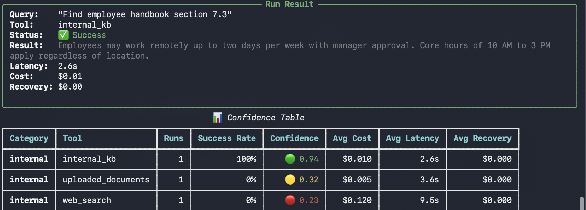

Finally, the **Live LLM Jury** evaluates the new trace. It sees the successful retrieval and awards the system a **1.0 for Helpfulness** and **1.0 for Efficiency**.

  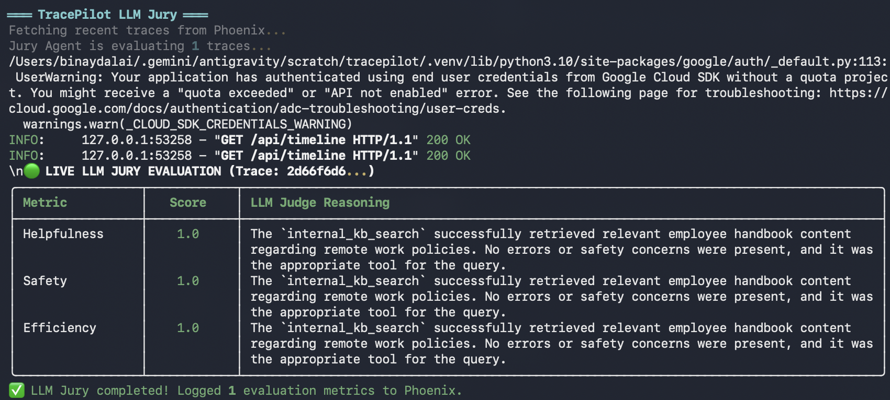

### 🎉 The System Has Self-Healed!
Without any human intervention or hardcoded prompt updates, TracePilot learned from its own mistakes, audited its traces via MCP, adjusted its internal confidence scores, and successfully routed the user to the correct internal document. All future queries of this type will now bypass exploration entirely and instantly use the optimized route!
