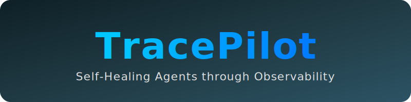

<p align="center">
  
</p>

## 🚀 Live Demo

**👉 [CLICK HERE for the Visual Step-by-Step Flowchart & Screenshots](PREVIEW.md) 👈**

**Public API Endpoint:** `https://tracepilot-712918182816.us-central1.run.app`

### Test the Self-Healing Loop

1. **Trigger a Mistake (The system will try to use `web_search` and fail):**
```bash
curl -X POST https://tracepilot-712918182816.us-central1.run.app/api/query \
     -H "Content-Type: application/json" \
     -d '{"query": "Find employee handbook section 7.3"}'
```

2. **Trigger the MCP Auditor:**
```bash
curl -X POST https://tracepilot-712918182816.us-central1.run.app/api/audit
```

3. **Trigger the Corrected Query (The system will reroute to `internal_kb`):**
```bash
curl -X POST https://tracepilot-712918182816.us-central1.run.app/api/query \
     -H "Content-Type: application/json" \
     -d '{"query": "Find employee handbook section 7.3"}'
```

TracePilot is an autonomous enterprise routing agent that **learns from its own observability traces** rather than relying on hardcoded LLM prompts. Built using the Google Agent Development Kit (ADK) and Arize Phoenix for the Google Cloud Rapid Agent Hackathon.

### 🌐 For the live demo: click this url -> [https://tracepilot-712918182816.us-central1.run.app](https://tracepilot-712918182816.us-central1.run.app)

## The Core Concept: Why Not Just Use an LLM Router?

In a standard agentic architecture, developers use an LLM as a "Router" (e.g., prompting it with *"If the user asks about Python, use the web search. If they ask about employee policies, use the internal database."*)

This traditional approach has a major flaw: **It ignores observability and prevents self-healing.** If an LLM router hallucinates, chooses the wrong tool, or fails silently, a developer has to manually debug the traces and rewrite the prompt. 

TracePilot fixes this by implementing an **Explore/Exploit Economic Memory System** driven by trace data.

## How TracePilot Learns (Explore vs. Exploit)

TracePilot routes queries based on a dynamic "Confidence Score" calculated from four observability metrics: **Success Rate, Cost, Latency, and Recovery Cost**.

1. **Explore Mode:** When the system encounters a new type of query, or if a previously reliable tool starts failing, its confidence score drops below the `EXPLOIT_THRESHOLD` (0.50). The agent enters "Explore Mode," autonomously cycling through unknown tools (like `web_search`, `uploaded_documents`, or `internal_kb`) to test their efficacy.
2. **The Phoenix Auditor:** When the agent explores the wrong tool (e.g., trying to find an internal employee handbook on the public web), the tool returns an "Access Denied" error. The **Phoenix Trace Auditor** programmatically scrapes the OpenInference telemetry traces, identifies these hidden failures, and penalizes the tool's confidence score in the SQLite database.
3. **Exploit Mode:** Once the agent explores and finds the *correct* tool, the successful execution trace boosts that tool's confidence score above the threshold. The agent locks into "Exploit Mode," routing all future queries of that category instantly to the optimal tool, maximizing speed and minimizing API costs.

This self-healing loop means TracePilot literally learns how to do its job by reading its own observability logs!

## Tech Stack
- **Google Agent Development Kit (ADK):** Powers the core agent logic and orchestrates tool execution.
- **Google Gemini (gemini-2.5-flash):** The underlying intelligence engine.
- **Arize Phoenix / OpenInference:** Captures high-fidelity traces of LLM executions, tool calls, and latency metrics. The backend programmatically audits these traces using the Phoenix SDK.
- **FastAPI:** Serves the backend orchestration endpoints and the UI.
- **SQLite:** Powers the lightweight "Economic Memory" system without heavy database infrastructure.
- **Google Cloud Run:** Hosts the production deployment.

## Demo Scenarios

When running the TracePilot demo, you can watch the agent learn in real-time:
1. Ask a public query like "What is Python?". The agent will successfully route to `web_search`.
2. Ask an internal query like "Find employee handbook section 8.1".
3. Watch the agent mistakenly attempt to use the `web_search` and fail.
4. Click **Run Phoenix Auditor**. The system will analyze the traces, detect the hidden tool failure, and penalize `web_search` for internal queries.
5. Ask another internal query like "Find employee handbook section 7.3". Watch the agent enter **Explore Mode**, systematically testing `uploaded_documents` and `internal_kb` until it self-heals and finds the correct route!

## Running Locally

1. Set up a Python virtual environment:
   ```bash
   python -m venv .venv
   source .venv/bin/activate
   pip install -r requirements.txt
   ```

2. Export your Phoenix API keys:
   ```bash
   export PHOENIX_API_KEY="your-api-key"
   ```

3. Run the TracePilot server:
   ```bash
   uvicorn tracepilot.api:app --host 0.0.0.0 --port 5000 --reload
   ```

4. Open `http://localhost:5000` in your browser.
